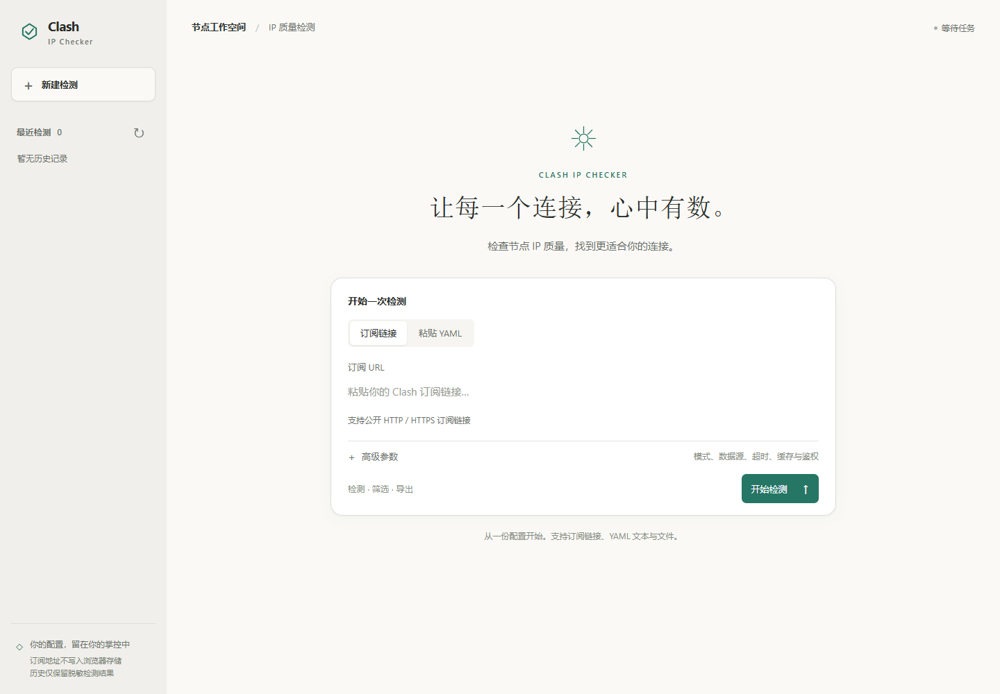
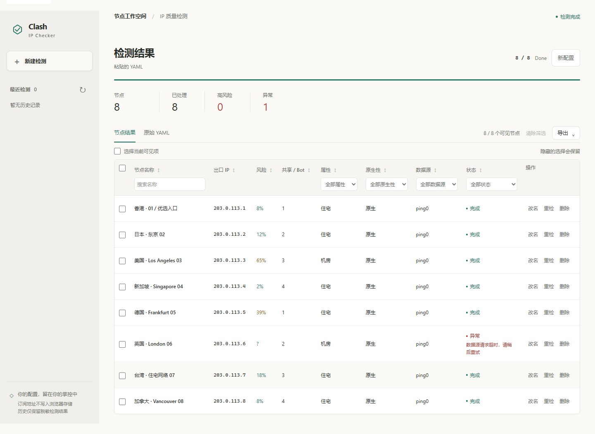
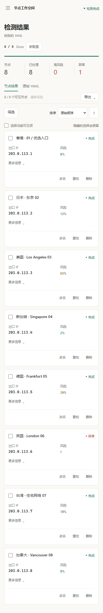

# Clash IP Checker

**把 Clash / Mihomo 订阅中的节点，整理成可筛选、可编辑、可导出的 IP 检测结果。**

输入订阅链接，或粘贴、上传 Clash YAML；服务通过 Mihomo 逐个切换节点，查询出口 IP、风险和网络属性。浏览器里可以实时查看进度、定位异常、整理节点并导出配置。项目使用 FastAPI 和原生 HTML / CSS / JavaScript，推荐用 Docker Compose 部署。

[English](./README_EN.md) · [部署说明](./DEPLOY_GCP.md) · [许可证](./LICENSE)

[](https://github.com/leeflouring/clash-ip-checker/actions/workflows/docker-image.yml)



<details>
<summary>查看桌面结果与手机界面</summary>





</details>

> 截图使用模拟节点与保留示例 IP（`203.0.113.0/24`），仅展示界面，不代表真实检测结果。

## 能做什么

- **三种输入**：订阅 URL、粘贴 YAML、上传 `.yaml` / `.yml` 文件；高级选项按需展开。
- **逐节点检测**：快速 HTTP 模式或服务端无头浏览器模式；查看进度、出口 IP、风险、网络属性、数据来源及失败原因。
- **整理结果**：按名称和属性筛选、按表头排序、勾选当前可见项；任务完成后可改名、删除或重检单个节点。
- **带走配置**：查看原始 YAML，复制或下载所选/全部节点的 YAML、CSV；未选中节点时导出全部。未启用 API 令牌时还可尝试在 Clash 中打开。
- **查看历史**：最近的终态任务以脱敏、只读快照保存在服务端，可查看和删除。桌面表格与手机结果项共用同一份筛选和排序状态。

## 五分钟启动

需要 Docker 和 Docker Compose plugin（命令为 `docker compose`），以及一个可用的 Clash/Mihomo 订阅或 YAML 文件。

```bash
git clone https://github.com/leeflouring/clash-ip-checker.git
cd clash-ip-checker
docker compose config
docker compose pull
docker compose up -d
curl -fsS http://127.0.0.1:8000/health
```

浏览器打开 <http://127.0.0.1:8000/ipcheck>。远程部署时，把 `127.0.0.1` 换成服务器地址；`0.0.0.0` 是监听地址，不能作为浏览器访问地址。启动异常可运行 `docker compose ps` 和 `docker compose logs --tail=200 clash-checker` 查看状态。

Compose 默认拉取 `ghcr.io/leeflouring/clash-ip-checker:latest`，只发布宿主机 `8000` 端口。Mihomo 的代理与控制器仅在容器 loopback 上监听；任务文件和历史存放在 `clash-data` volume。镜像支持 amd64 / arm64，容器以 UID 10001、只读根文件系统运行。每次推送到 `main`，GitHub Actions 会构建并发布 `latest`、`main` 和 `sha-...` 镜像标签；`v*` Git 标签还会发布版本标签。拉取私有 GHCR 包时，先使用具备 `read:packages` 权限的令牌执行 `docker login ghcr.io`。

## 使用流程

1. 在首页输入订阅 URL，或切换到 YAML 并粘贴内容、选择文件。需要调整模式、超时、回退或 API 令牌时，展开「高级参数」。
2. 点击「开始检测」。任务运行时可取消；页面会显示实时进度和已得到的节点结果。刷新页面后可用当前会话保存的任务 ID 恢复。
3. 在结果区筛选、排序和选择节点。任务结束后可改名、删除、重检，或从「导出」菜单获取 YAML / CSV。历史列表位于侧栏，历史快照只能查看和筛选，不能修改或导出。

快速模式默认使用 Ping0。开启回退后，主数据源失败时会尝试另一内置来源，最后尝试第三方 IPQuery；浏览器模式解析失败也可进入这条回退链。IPQuery 不能确认原生/广播属性，因此对应结果会显示“未知”。关闭回退后不会请求 IPQuery。浏览器模式在服务端以 headless shell 运行，较快速模式占用更多内存；单个 Mihomo 工作进程串行检测节点。

## 常用配置

可在 `docker-compose.yml` 的 `environment` 中设置，或通过 Compose 环境变量传入。以下是应用默认值；Compose 文件显式设置的值以 Compose 为准。

| 变量 | 默认值 | 用途 |
| --- | --- | --- |
| `API_TOKEN` | 空 | 保护任务、结果、订阅和历史 API；建议对外提供服务时设置 |
| `ALLOW_PRIVATE_SUBSCRIPTIONS` | `false` | 默认拒绝私网订阅地址及带凭据的 URL；仅在明确需要时允许私网目标 |
| `SOURCE` / `FALLBACK` | `ping0` / `true` | 快速检测首选来源及失败回退 |
| `REQUEST_TIMEOUT` | `15` | 单次检测请求超时，单位秒 |
| `MAX_QUEUE_SIZE` / `MAX_AGE` | `10` / `360` | 队列上限及兼容订阅缓存秒数 |
| `JOB_TTL` / `MAX_JOBS` | `3600` / `100` | 内存任务保留秒数及历史记录上限 |
| `MAX_SUBSCRIPTION_BYTES` / `MAX_REDIRECTS` | `5242880` / `3` | 订阅下载大小及重定向边界 |
| `DATA_DIR` / `CONFIG_PATH` | `/data/jobs` / `/app/config.yaml` | 持久数据与应用配置路径 |

设置 `API_TOKEN` 后，页面中的令牌只保留在当前页面内存中，受保护 API 改用 Bearer 授权轮询。Clash deep link 和直接使用兼容订阅地址 `/check` 无法携带该请求头；请下载 YAML 后导入客户端，或在 TLS 反向代理层配置相应认证。`/health`、静态资源和 UI 配置接口仍公开。

## 数据与安全边界

浏览器 `sessionStorage` 只保存不透明任务 ID，不持久化订阅 URL、API 令牌或原始 YAML。服务端会保存检测所需的生成配置；最近历史只保留脱敏标签、终态统计和公开结果行，不保存订阅 URL、令牌、原始 YAML 或代理凭据。默认拒绝私网订阅目标和 URL 内嵌凭据。对公网开放时，请设置访问令牌，并通过 TLS 反向代理及防火墙限制访问。

## 升级与排障

升级前先备份 `clash-data` volume。更新 `main` 分支代码后执行：

```bash
docker compose pull
docker compose up -d
docker compose ps
docker compose logs --tail=200 clash-checker
```

需要回滚时，将 `IMAGE_TAG` 指向之前的 `sha-...` 标签并执行 `docker compose up -d`，必要时恢复 volume。旧版 `./data` 目录应先迁移到 volume 的 `/data/jobs`。浏览器模式内存不足时提高容器内存；队列满时检查提交速率及 `MAX_QUEUE_SIZE`。更完整的部署说明见 [DEPLOY_GCP.md](./DEPLOY_GCP.md)。

## 开发与验证

核心 API 保留 `/ipcheck` 和旧版 `GET /check?url=` 兼容入口。代码库的单元测试使用模拟检测源，无需真实订阅即可运行：

```bash
python -m pip install -r requirements.txt
python -m unittest discover -s tests -v
node --check static/js/app.js
```

本地构建可运行 `docker build -t ghcr.io/leeflouring/clash-ip-checker:local .`，然后运行 `IMAGE_TAG=local docker compose up -d --pull never`。多架构发布由 GitHub Actions 完成。

项目基于 [tombcato/clash-ip-checker](https://github.com/tombcato/clash-ip-checker) 持续改造，遵循仓库中的 [GPL-3.0 许可证](./LICENSE)。
